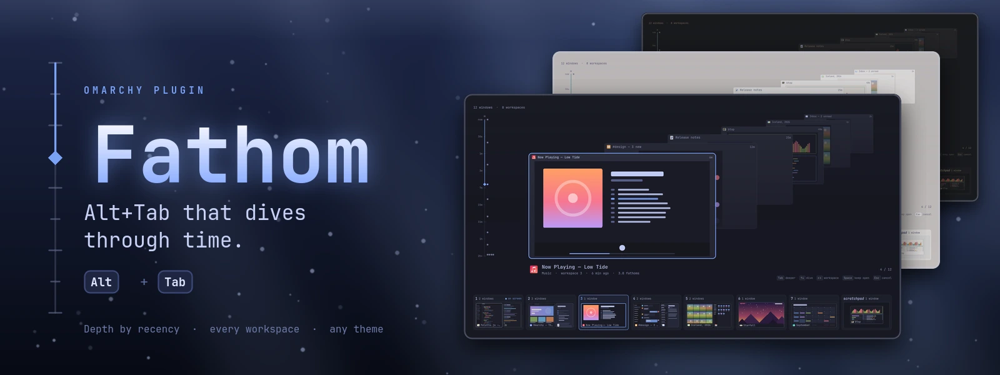
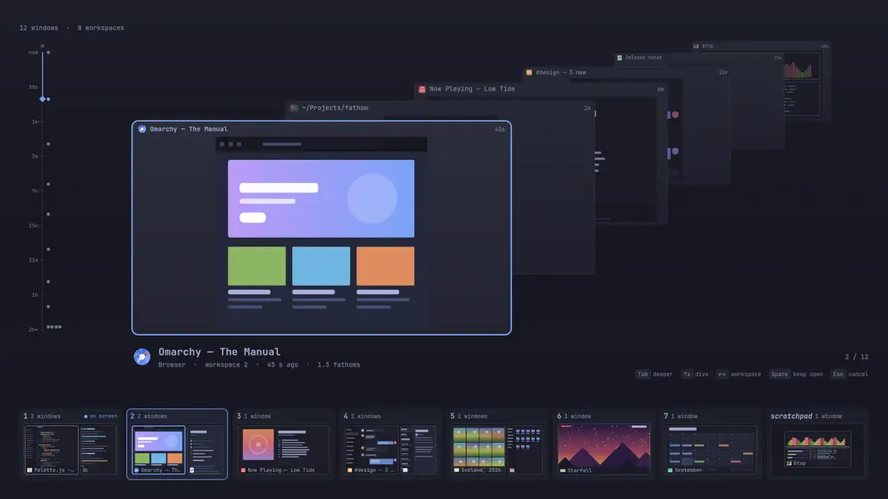
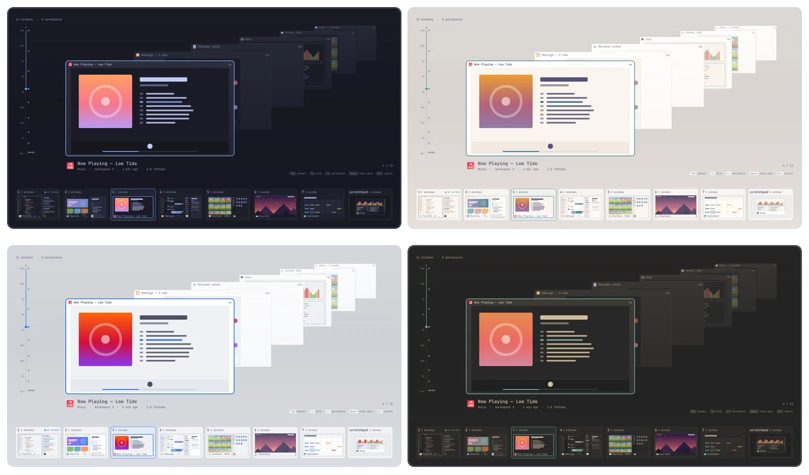

<p align="center">
  
</p>

# Fathom

A depth-based Alt+Tab for [Omarchy](https://omarchy.org/) Quattro.

Windows are placed on a z-axis by how long ago you last used them. The window
you used most recently is in front; older ones recede into the distance and
the fog. Hold `Alt`, dive with `Tab`, the arrows or the wheel, release `Alt` to
focus the window in front. Below the stack, a map shows every workspace with
its windows where they really are.

<p align="center">
  
</p>

Fathom is an overlay only: it never moves, resizes or closes a window. Focusing
the one you pick is the only thing it asks the compositor to do. It starts no
program, writes no file, and captures windows only while it is open.

## What you see

- **The Deep.** The window you are about to switch to is a large live card in
  front. Every window behind it is a card too, stepping back up and to the
  right, each with its app icon, title and how long ago you used it. Older
  windows sink into the fog.
- **The map.** A card per workspace (scratchpads included) with a minimap of
  its windows at their real positions, each showing the last frame Fathom saw
  of it (else its app icon) and its title where there is room. You see which
  workspace is on screen, which window is focused, which one wants your
  attention, and what a scrolling layout has parked beside the screen.
- **The sounding line.** A depth gauge beside the stack, marked in fathoms from
  "now" at the surface to two hours down. Every window is a dot at its depth,
  and the sounding lead hangs at the one you are on, descending as you dive;
  the light fades with it. Click or drag along the line to pick a window by
  how long ago you used it.
- **The caption.** The selection's title, app, workspace, age and depth.
- **Your theme, light or dark.** Every color comes from the Omarchy theme and
  follows it live. On a light theme the cards are paper above a pale veil;
  on a dark one, glass in the dark. Text is held to a readable contrast in
  every theme Omarchy ships.

<p align="center">
  
</p>

A window your scrolling layout parks beside the screen cannot be captured
(Hyprland does not render it). Fathom shows the last frame it saw of that
window, marked "last seen", or says it is off screen. Those frames stay in
memory only, and the map reuses them: it captures nothing of its own.

## Keys

Hold `Alt` while you use these; release `Alt` to focus the selection.

| Keys | Action |
| --- | --- |
| `Alt`+`Tab` | Open on the window you used before this one |
| `Tab` / `Shift`+`Tab` | One window deeper / shallower (wraps) |
| `↓` / `↑`, wheel | One window deeper / shallower |
| `→` / `←`, sideways wheel | The most recent window of the next / previous workspace |
| `1` to `9` | The most recent window on that workspace |
| `Home` / `End`, `PageDown` / `PageUp` | Front / back, five windows |
| Type letters | Filter by app, title or workspace (`Space` between words) |
| `Space` | Keep the field open after you release `Alt` |
| Click or drag on the sounding line | The window at that depth |
| `Enter`, a click on a window or the caption | Focus it |
| `Escape` | Clear the filter, or close without focusing |
| Click on empty space | Close without focusing |

A quick `Alt`+`Tab` switches back without drawing the overlay at all.

While you hold `Alt` after `Alt`+`Tab`, Fathom's bindings put Hyprland in a
`fathom` submap, so your own `Alt` shortcuts (Omarchy's `Alt`+`←` text
navigation, another switcher's `Alt`+`↑`) do not get in the way. They are back
the moment you release `Alt`.

Depth follows `log2(1 + seconds since focus / 30)`, clamped to 8: a window you
left 30 seconds ago is one unit deep, two minutes ago about 2.3, an hour ago
about 7. Right after the shell starts, Fathom knows the order of your windows
but not when you used them; those say "earlier" until you switch.

## Requirements

- Omarchy 4.0 or newer (Quattro: the Quickshell shell and its plugin system),
  with Quickshell 0.3 and Qt 6.9 or newer
- Hyprland 0.56 or newer, configured in Lua (Omarchy's default)

With a `hyprland.conf` instead of Lua, bind `Alt`+`Tab` and `Alt`+`Shift`+`Tab`
to the global shortcuts `fathom:next` and `fathom:previous` (for example
`bind = ALT, TAB, global, fathom:next`). The overlay commits when it sees `Alt`
released; a switch too quick for it to take the keyboard stays open until
`Enter` or `Escape`. The Lua snippet below does all of that for you.

## Install

```bash
omarchy plugin add https://github.com/mtolhuys/fathom --enable
```

Then give `Alt`+`Tab` to Fathom. Add this block at the end of
`~/.config/hypr/bindings.lua`:

```lua
-- fathom: begin
do
  local fathom = os.getenv("HOME") .. "/.config/omarchy/plugins/io.github.mtolhuys.fathom/hypr/fathom.lua"
  local file = io.open(fathom, "r")
  if file then
    file:close()
    pcall(dofile, fathom)
  end
end
-- fathom: end
```

Hyprland reloads its config when you save the file, and `Alt`+`Tab` opens
Fathom. The block does nothing while Fathom is not installed or not enabled
(the snippet checks the shell's `shell.json`), and an error in it can never
stop the rest of your config from loading.

Check who owns `Alt`+`Tab` at any time:

```bash
bash ~/.config/omarchy/plugins/io.github.mtolhuys.fathom/bin/load-bindings --check
```

The snippet takes over `Alt`+`Tab` and `Alt`+`Shift`+`Tab` from Omarchy's
defaults, adds a key hook that reports the `Alt` release (following XKB
options that move `Alt`, such as `altwin:swap_alt_win`, and ignoring an
`AltGr`), and frosts the background behind the overlay. If another switcher binds `Alt`+`Tab`, remove
its line, or keep it as the fallback for when Fathom is not installed:

<details>
<summary>The block with a fallback switcher</summary>

```lua
-- fathom: begin. Alt+Tab is Fathom's; altswitch is the fallback.
do
  local plugins = os.getenv("HOME") .. "/.config/omarchy/plugins/"
  local function exists(path)
    local file = io.open(path, "r")
    if file then file:close() end
    return file ~= nil
  end
  local fathom = plugins .. "io.github.mtolhuys.fathom/hypr/fathom.lua"
  local fallback = plugins .. "io.github.pablo-merino.altswitch/altswitch.lua"
  local ok, holds = false, false
  if exists(fathom) then
    ok, holds = pcall(dofile, fathom)
  end
  if not (ok and holds) and exists(fallback) then
    dofile(fallback)
  end
end
-- fathom: end.
```

</details>

Without the snippet, any binding can drive Fathom over IPC:
`omarchy-shell fathom hold 1` behaves like `Alt`+`Tab`,
`omarchy-shell fathom release` like releasing `Alt`, and
`omarchy-shell fathom open` opens the overview to browse with the keyboard.

## IPC

```bash
omarchy-shell fathom open       # open for browsing (Enter or click to focus)
omarchy-shell fathom state      # build identity, open state, counts, filter
omarchy-shell fathom field      # every window with app, workspace, age, depth, fog
omarchy-shell fathom bench 10   # dive through the field for 10 s with the frame probe on
omarchy-shell fathom stats      # frame times of the last bench
omarchy-shell fathom captures   # which cards capture and which received a frame
```

The full list is in [docs/SPEC.md](docs/SPEC.md#ipc).

## Update

```bash
omarchy plugin update io.github.mtolhuys.fathom
```

A change to the bindings takes effect at the next config reload: save
`~/.config/hypr/bindings.lua`, or run `hyprctl reload`.

## Remove

```bash
omarchy plugin remove io.github.mtolhuys.fathom
```

Then delete the `fathom: begin` to `fathom: end` block from
`~/.config/hypr/bindings.lua` (put back your previous switcher's line if you
had one). Hyprland reloads on save and `Alt`+`Tab` is Omarchy's again.

## Troubleshooting

- **`Alt`+`Tab` does nothing after `omarchy plugin disable`.** The bindings
  follow the shell's plugin list at each config reload: save
  `~/.config/hypr/bindings.lua` (or run `hyprctl reload`) and `Alt`+`Tab` is
  Omarchy's again. Enabling works the same way.
- **The overlay does not open.** `omarchy-shell fathom state` should answer;
  if it does not, the plugin is not loaded (`omarchy plugin list`).
  `load-bindings --check` (above) says who owns `Alt`+`Tab`.
- **Your `Alt` is on another key.** Fathom reads `input:kb_options` at each
  switch; tell us about a remap it misses.

## Development

```bash
bash bin/test              # manifest, logic, Lua bindings, offscreen QML tests,
                           # qmllint, ShellCheck, `omarchy plugin validate`
bash tests/qml/render.sh   # render the field offscreen into screenshots-local/
bash bin/make-art          # the preview, the banner and the demo, from the QML
bash bin/dev-sync          # install the working tree, stamped with its identity
bash bin/dev-status        # is the running Fathom the working tree? (read-only)
bash bin/revalidate        # point an open marketplace submission at the current main
bash bin/load-bindings     # the only way to write to the running Hyprland (--check, --fresh)
```

`bin/dev-sync` runs the tests, installs the working tree through `omarchy
plugin add`, enables it and waits until exactly this build answers on IPC.
When the installed snippet changed it reloads Hyprland's config through
`bin/load-bindings`. Never load the snippet with a raw `hyprctl eval`:
`bin/load-bindings` refuses an unsafe snippet, loads it at most once per
Hyprland Lua state, and checks that Hyprland is still the same process
afterwards (see
[docs/HYPRLAND-0.56.2-LUA-RELOAD-CRASH.md](docs/HYPRLAND-0.56.2-LUA-RELOAD-CRASH.md)).

The offscreen QML tests and renders need the Qt 6 `qmltestrunner` (package
`qt6-declarative`). They run the real controller and view against stub
Quickshell modules in `tests/qml/stubs`.

Fathom follows the [omakit](https://github.com/mtolhuys/omakit) workflow. On a
committed change:

```bash
omakit inspect .                                   # what the tree does, file and line
omakit verify .                                    # the marketplace's own security baseline
omakit submit . --category <c> --tags <a,b> --offline
omakit weigh io.github.mtolhuys.fathom             # restarts the shell; asks first
```

Fathom starts no program and keeps no file of its own, so it carries neither
of omakit's blocks; `DEVELOPMENT.md` says what happens if that ever changes.

## Known limitations

- Windows opened while the field is open join the next switch.
- A scrolling layout's windows parked beside the screen cannot be captured
  live (Hyprland does not render them); they show their last seen frame, or
  their app icon until Fathom has seen them.
- The recency map starts over when the shell restarts (Fathom writes no
  files); it is seeded from Hyprland's focus order.
- Mouse parallax is not built yet.

## License

[MIT](LICENSE)
